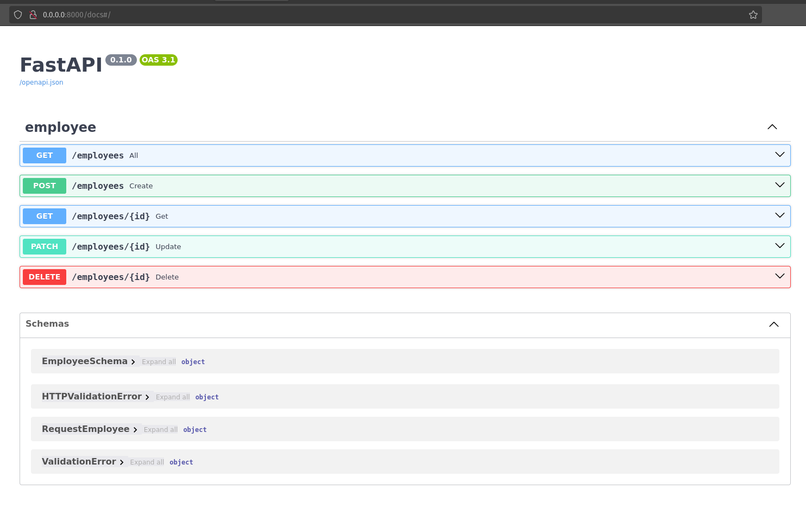

# 1. Тестовое задани
Разработать full-stack приложение с ассинхронним CRUD операциями на:
- Python/FastAPI
- Vue/Next/Axios
- PostgreSQL
- docker-compose


# 2. Установка/Запуск
```bash
git clone <repo> app
cd app

cp .env.example .env

docker-compose up -d --build
```

**urls:**
- frontend http://localhost:3000/
- backend  http://localhost:8000/
- docs rest-api  http://localhost:8000/docs

**ports:**
- fastapi - 8000
- nuxt.js - 3000
- pgsql -   5432


# 3. Примеры


