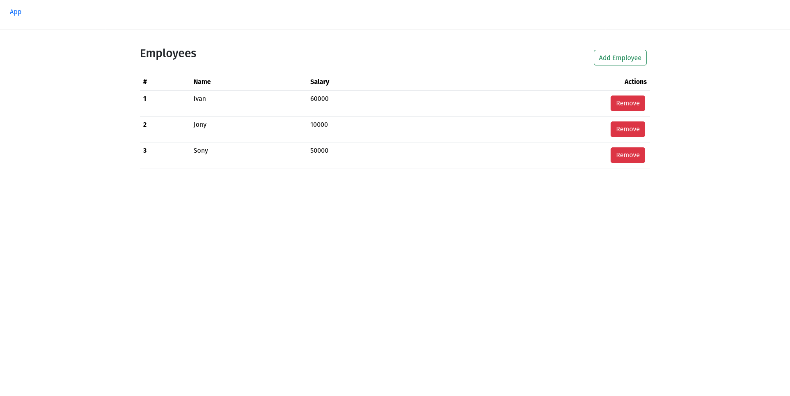

# 1. Тестовое задани
Разработать full-stack приложение с ассинхронним CRUD операциями на:
- Python/FastAPI
- Vue/Next/Axios
- PostgreSQL
- docker-compose


# 2. Установка/Запуск
```bash
git clone <repo> app
cd app
docker-compose up -d --build
```

- backend  http://localhost:8000/employees
- frontend http://localhost:3000/employees

# 3. Примеры
)
